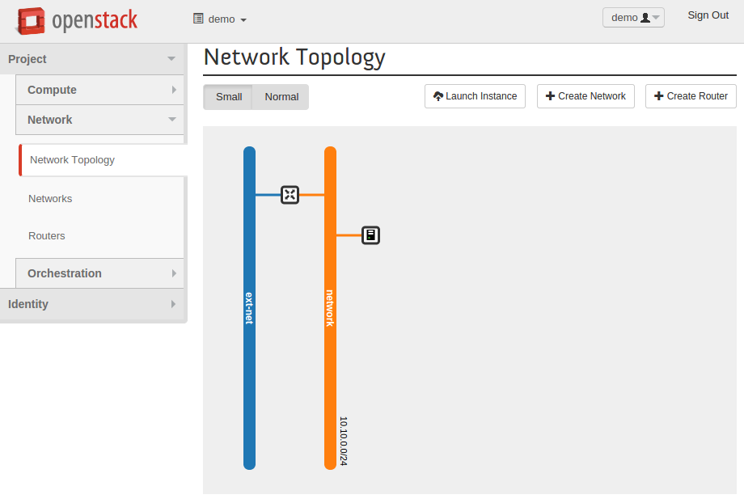

========
Appendix
========

Bootstrap your network
~~~~~~~~~~~~~~~~~~~~~~

Most cloud providers provision all network objects that are required
to boot an instance. To determine whether these objects were created
for you, access the Network Topology section of the OpenStack
dashboard.

Specify a network during instance build
~~~~~~~~~~~~~~~~~~~~~~~~~~~~~~~~~~~~~~~

.. todo:: code for creating a networking using code

.. only:: shade

    Add the parameter network and send its name or id to attach the instance to:

    .. code-block:: python

        testing_instance = conn.create_server(wait=True, auto_ip=True,
            name=instance_name,
            image=image_id,
            flavor=flavor_id,
            network=network_id)

.. only:: gophercloud

    Add the option Networks and send its id to attach the instance to:

    .. code-block:: go

        opts := servers.CreateOpts {
            Name: instanceName,
            ImageRef: image.ID,
            FlavorRef: flavor.ID,
            SecurityGroups: []string{securityGroupName},
            UserData: []byte(userData),
            Networks: []servers.Network{servers.Network{UUID: networkID}},

        }

        testingInstance, _ = servers.Create(client, keypairs.CreateOptsExt {
            CreateOptsBuilder: opts,
            KeyName: keyPairName,
        }).Extract()
